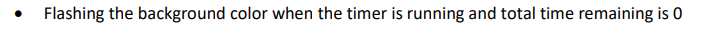

Can be started by running npm start (might need an npm install on first run first)

Deze assignment is een half leer projectje geworden.
Hierdoor heb ik wat extra dingen toegevoegd.

Verder lukte het mij niet om een flikkerende rode achtergrondkleur te krijgen,
ik heb hierom de keuze gemaakt om in plaats hiervan alle tekst (en een border) te laten flikkeren op de laatste 5 seconden van de countdown.

